# Nutrients

By Weng (Weng Fei Fung).


<a target="_blank" href="https://github.com/Siphon880gh" rel="nofollow"></a>
<a target="_blank" href="https://www.linkedin.com/in/weng-fung/" rel="nofollow"></a>
<a target="_blank" href="https://www.youtube.com/@WayneTeachesCode/" rel="nofollow"></a>

You log the foods you ate for each day of the week. Each line is matched to a **food definition** that stores that food’s macros and nutrients. Those values roll up into the dashboards: daily/weekly macros and calories, **micronutrients** vs daily targets, and **longevity** nutrients by section. Your **TDEE**, **body weight**, and **gender** shape nutrient targets and macro and calorie goals.

Client-only nutrition tracker for weekly meals and reusable food definitions. The app runs from static files: `index.html`, `styles.css`, and `app.js`. Sample food data lives in `samples/definitions-food.json`.

## Quick start

Serve the folder over HTTP (required for `fetch` of sample JSON), then open `index.html`:

```bash
python3 -m http.server 8765
# open http://localhost:8765/
```

On first visit, use **Import sample** in two places:

1. **Food definitions** — scroll to the Food definitions table and click **Import sample** (or **Import our sample** when the table is empty). This loads `samples/definitions-food.json`.
2. **Food entry** — in the Mon–Sun day-meals area, click **Import sample**. This loads `samples/day-meals.json` for the current week.

Type food names in day meals that match your definitions; macros, micros, and longevity totals update automatically.

## How it works

### Dashboard — macros and calories

Empty week before any meals are logged:

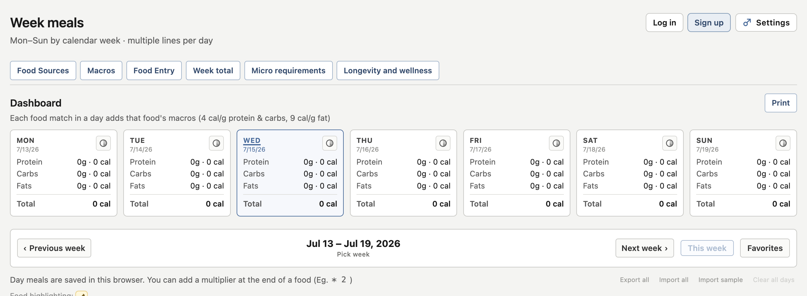

After importing sample meals, each day shows protein, carbs, fats, and total calories:

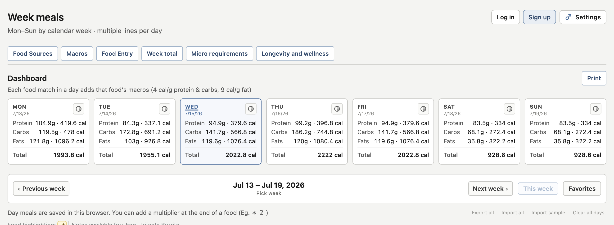

### Food definitions

Define reusable foods with macros, micronutrients, and longevity fields. Start empty:

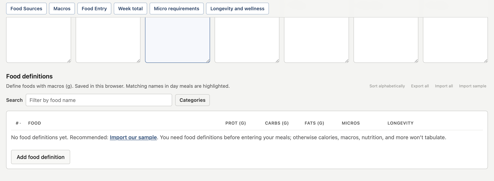

Click **Import sample** to load bundled definitions (trail mix, peanuts, eggs, rice, and more):

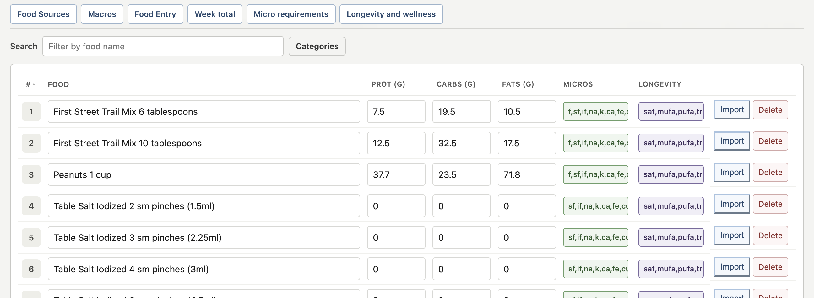

### Food entry — Mon–Sun meals

Log what you ate each day. Lines can include a serving multiplier (e.g. `* 2`):

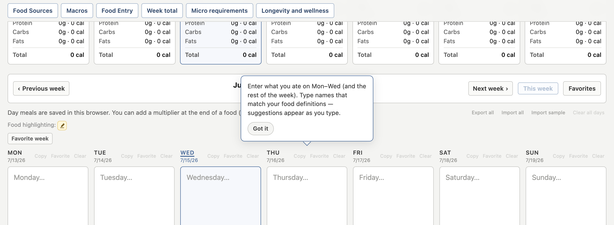

**Import sample** fills the week with example meals. Matched foods are highlighted and roll up to the dashboard:

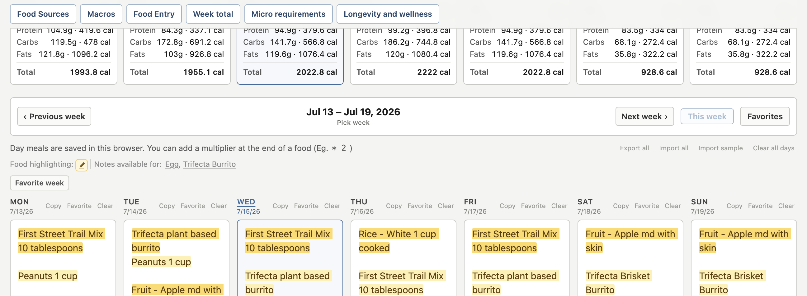

Here's a food entry that uses multipliers `*4` and divider lines (doesn't cause matching errors):
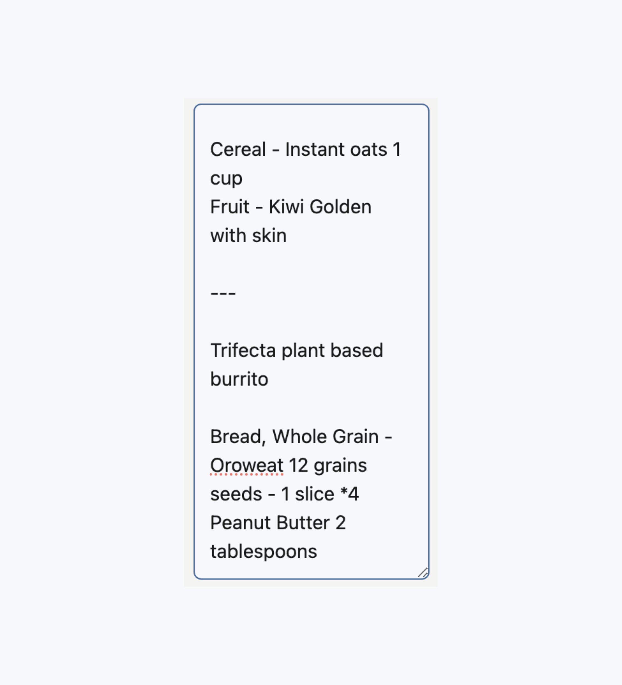


### Micro requirements

Weekly average (or per-day) intake vs FDA % DV or IOM body-weight minimums. Set body weight in Settings for nutrients without an FDA DV:

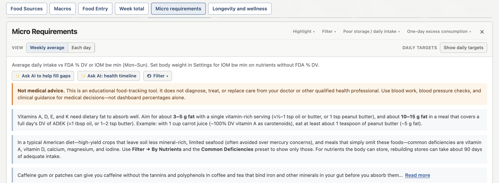

Nutrient cards show % of target with color-coded status:

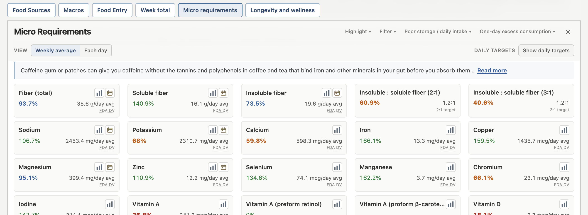

### Longevity and wellness

Longevity nutrients by section — fats, omegas, fiber, and related compounds for healthy aging:

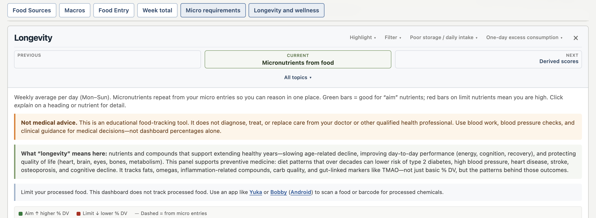

% DV bars for aim nutrients (higher is better) and limit nutrients (lower is better):

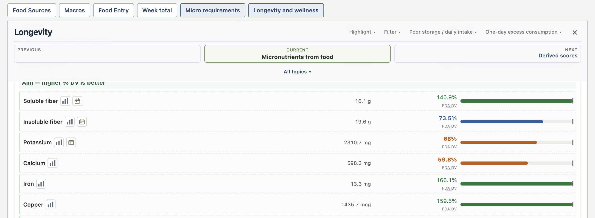

## App Data

- `samples/definitions-food.json` contains bundled food definitions for import.
- `definitions-micronutrients.json` and `definitions-longevity.json` contain nutrient explanation copy.
- `demographic-dv.js` and `longevity-dv.js` provide daily value targets.
- Browser `localStorage` (via `persist.js` / `NutrientsPersist`) stores food definitions, day meals, favorites, and settings across sessions. See `specs-data-persistence.md`.

## QA Food Definitions Tool

Use `.agents/skills/qa-definitions-food.json` to audit food definition nutrients with AI.

The tool explains its purpose when invoked, asks which sample file to QA, asks whether to use the default nutrient set or a custom list, then rotates through nutrient-food pairs that still need review.

Example prompt to invoke tool: "Let's QA the food definitions at samples/" 

Default audit nutrients:
- Magnesium
- Potassium
- Calcium
- Zinc
- Vitamin D
- Vitamin A
- Vitamin C
- Fiber

The QA flow only asks AI about foods where the selected nutrient is `0` or missing. Reviewed pairs are tracked by hash key:

```text
{nutrientKey}|{foodName}
```

The default progress file is `samples/definitions-food-qa-checked.json`.

Example prompt with the definitions file opened:

```
Use qa skill that's found locally and make sure the food definitions have Manganese amounts if a food has it.
```

## Categorize Food Definitions Tool

Use `.agents/skills/categorize-food-definitions.json` to find food names that match no category in `definitions-food-categories.json`, then assign them to an existing category (extend patterns) or a new category.

Helper: `node scripts/list-uncategorized-foods.js [--json] [foods.json]`

Example prompt: "Categorize any uncategorized foods"
